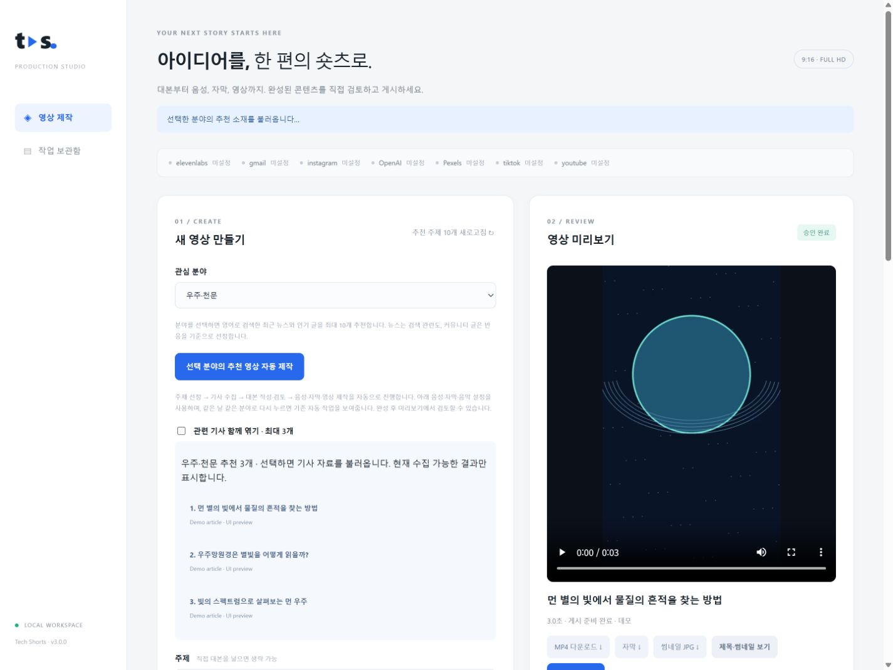
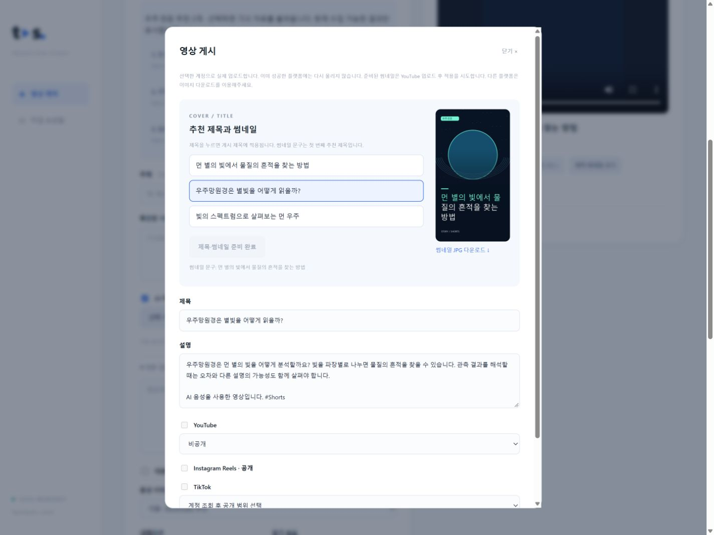

# Tech Shorts Studio

A local-first production studio for Korean narrated Shorts: discover articles, review source-grounded scripts, choose a voice, render portrait videos, and approve them before publishing. The Flask UI supports YouTube Shorts, TikTok, and Instagram Reels.





These screenshots illustrate an earlier version of the real Korean-language Studio; some controls have since changed. They were captured with isolated demo content and disconnected accounts. They do not represent live news, production duration, or a successful platform upload.

## Features

- **17 fields and ten suggestions:** Select politics/world affairs, society, economy/industry, IT, AI, science, space, film/TV, music, history, psychology, nature, environment/energy, automotive, food/culture, travel/geography, or architecture/design. News discovery uses public Bing News RSS with English queries in the en-US market and fills gaps with newest results. Undated articles and items older than 30 days are excluded. IT also uses Hacker News; configured Reddit OAuth adds each field’s hot external links. Duplicate URLs/titles are removed. News rankings are relevance/recency, not measured popularity; actual community scores are labeled separately. If fewer than ten eligible items are available, show the actual count.
- **Audience-first storytelling:** OpenAI drafts open with a concrete curiosity hook, explain why it matters to the viewer, and resolve the opening question. Enable the related-articles option to combine up to three sources; each article can provide up to 24,000 characters. Review excerpts before generating the draft.
- **Article-based production:** Select a topic to retrieve its article text, review the source material, and start production. Extraction prefers marked article-body regions or the main article over surrounding menus and related headlines; older unstructured pages use paragraph extraction as a fallback. If the article cannot be accessed, enter the key facts manually.
- **Korean scripts:** Generate narration and background search queries from the supplied material using GPT, or provide your own script.
- **ElevenLabs and OpenAI narration:** Choose a voice provider. Automatic mode prefers ElevenLabs when its API key is configured. Whisper generates timestamped Korean subtitles.
- **Automatic editorial workflow:** Automatic mode is enabled by default. OpenAI extracts an evidence-backed list of material facts and canonical English names, writes the script, then independently audits coverage, unsupported claims and the ending. OpenAI extracts a plain-Korean glossary for unfamiliar specialist terms. When a specialist term is used, a natural plain-language explanation must accompany its first occurrence. The audit accepts accurate paraphrases and rejects dense chains of definitions. The independent audit also checks narrative flow, number/cost scope, jargon clarity and whether the next section answers the middle question. Failed drafts are automatically rewritten, up to three editorial attempts. Manual draft editing remains optional.
- **Speech-timed scenes:** Group timestamped subtitle phrases into sentence beats and shots up to 4.5 seconds. Plan varied, concrete visual queries with story context and exclude clip IDs already used in the video. Scene plans and downloaded clips are reused on retry.
- **Visual relevance:** OpenAI compares up to six candidate thumbnails with each narration beat before downloading a clip. If none fits, it can suggest alternative searches, with up to three searches per scene. If no suitable clip is found, OpenAI drafts a narration-grounded concept card and independently checks its text; the renderer creates a gently animated explanatory graphic. Production stops if the graphic fails validation. Unrelated generic footage is not substituted. Thumbnail review is model-based and does not inspect every video frame. Footage is illustrative, not verified imagery of the actual product. Automatic selection requires an image-capable script model.
- **Subtitle designs:** Choose Focus (mint accents) or Minimal (white). Both use large 96px captions in the 1080p design space, up to three lines per card, gentle fades, and safe lower-screen margins. A global layout balances adjacent fragments into readable cards without crossing long pauses. Word times inside each recognition phrase are estimated by character weight for display only; downloadable SRT timing is preserved. Downloadable SRT files retain recognition timing and plain text.
- **Adjustable background music:** An optional, locally synthesized instrumental bed is enabled by default. The editor chooses a neutral, tense or bright mood; a full-length arrangement varies voicing, rhythm and intensity instead of repeating an eight-second loop. Choose Quiet, Normal (default), or Strong. The music gain is 0.08, 0.18, or 0.28 after separate loudness normalization; speech-driven ducking lowers it further, with short entrance and exit fades. Disable it in the Studio or send `bgm: false` to the API. Set server-side `BGM_PATH` to use your own suitable audio file.
- **Script-based pacing:** Default narration speed is 1.2x. Length is checked using script characters only: 550-900 characters are recommended, with up to 1,400 allowed to retain the full material-fact checklist. Actual audio duration is used for subtitle timing and muxing, not for paid script or narration regeneration. Content completeness takes priority over a fixed running time. The renderer supports videos up to 180 seconds.
- **Audience questions:** Include one short curiosity question at a meaningful narrative transition and a brief closing question or reflection without a repeated factual recap. The next section answers the middle question; the closing question encourages a useful action or thought. At most three questions, including an optional opening question, are allowed in a script.
- **Narration delivery:** Script prompts favor one idea per sentence and natural pauses. OpenAI delivery instructions emphasize important terms and deliberate pacing; ElevenLabs uses a stability setting of 0.4.
- **Rendering progress:** The Studio reports music preparation, each scene and its encoding percentage, final composition percentage, and output validation. Render failures retain FFmpeg diagnostics with input URLs removed. Retrying reuses saved narration, subtitles and downloaded backgrounds; encoding resumes by rebuilding the render.
- **Video output:** Use portrait backgrounds at Full HD or higher for each speech beat, and render at 1080 x 1920 and 30 fps with Lanczos scaling, CRF 18 encoding, bold subtitles, and loudness normalization.
- **Review and publishing:** Preview videos, download MP4 and subtitle files, approve or reject jobs, and publish to YouTube Shorts, TikTok, or Instagram Reels. Each platform requires its own credentials.
- **Shorts-ready thumbnail hooks:** Each new video gets three distinct Korean hooks grounded in the final script. Suggestions favor provocative wording, curiosity, surprising contrasts, and concrete stakes without inventing facts. The prompt prefers 8–24 characters (60 maximum). Click a suggestion to fill both the posting-title and thumbnail-text fields. Successful suggestions are cached across retries; initial generation adds one language-model request.
- **Portrait thumbnails:** Automatically compose a 1080 x 1920 JPEG from existing footage with Korean typography, a contrast gradient and a category label. This is local image composition, not a separately generated AI photograph. The first suggestion is the initial cover text. Select another suggestion or write your own text (1–100 characters), then click **Apply to thumbnail** to rebuild the JPEG. Manual edits require no language-model request. The posting title remains independently editable; changing that field alone does not change the image.
- **Existing videos:** Open **View titles and thumbnail** to prepare missing assets or apply custom thumbnail text without regenerating narration, scenes, or the final MP4. Failures preserve the finished video and allow asset retries.

The generated thumbnail is a separate downloadable 1080 × 1920 JPEG. It is never prepended to new videos, so narration and subtitle timing remain unchanged. For a legacy job with a 0.5-second intro, use the presentation button to restore its preserved original video and subtitles without re-encoding. Previously published posts are not modified.

SQLite and local files are the defaults; GCP persistence is optional.

## Quick Start on Windows

Install Python 3.11 or newer and a Korean font. The application uses an installed FFmpeg executable or the executable supplied by `imageio-ffmpeg`.

```powershell
.\setup.ps1
```

The setup script copies `.env.example` only when `.env` does not exist. Add missing settings to your existing `.env` without overwriting it.

| Setting | Purpose |
| --- | --- |
| `OPENAI_API_KEY` | Script generation, Whisper subtitles, and OpenAI narration |
| `PEXELS_API_KEY` | Background video search and downloads |
| `ELEVENLABS_API_KEY` | Optional ElevenLabs narration |
| `SHORTS_API_TOKEN` | Required for access beyond localhost; use a long random token |

```powershell
.\Start-Studio.ps1
```

Open the [local Studio](http://127.0.0.1:8080) in your browser. The Studio interface and generated narration are currently in Korean.

1. Select a field to load up to ten suggested articles. Choose an article, or use **Automatically produce a video for this field** to select a readable article and produce the video automatically.
2. Review or edit the extracted article text. Selecting a new topic clears the previous script.
3. Leave automatic completion enabled to generate, review, and revise the script through the configured APIs. To supply your own script, disable it and confirm the optional draft review.
4. Choose the voice provider and voice, reading speed, music level, and subtitle design, then start production.
5. Review the finished video, subtitles, suggested titles and thumbnail. Download the files or approve the video before publishing.
6. Open the publishing dialog. Select a suggested hook or enter custom thumbnail text and click **Apply to thumbnail**. Review the updated image and download its JPEG if needed. Edit the posting title separately, explicitly select platforms and privacy settings, then submit. Validation errors appear inside the dialog; upload results and warnings appear below the video.

Script, narration, and subtitle generation incur API charges. Scene planning also incurs a language-model API charge. Additional footage searches and higher-quality encoding can increase production time and output file size.

## ElevenLabs Configuration

Store your actual API key in the local `.env` file. This example contains no credentials:

```dotenv
TTS_PROVIDER=auto
TTS_SPEED=1.2
ELEVENLABS_API_KEY=
ELEVENLABS_VOICE_ID=JBFqnCBsd6RMkjVDRZzb
ELEVENLABS_MODEL=eleven_multilingual_v2
```

- `auto` selects ElevenLabs when its key is configured and OpenAI otherwise. Set `openai` or `elevenlabs` explicitly, or choose the provider in the Studio.
- Give the API key access to speech generation and **Voices: Read** (`voices_read`). A `401 missing_permissions` response means the key lacks the required endpoint permission; enable Voices read access in ElevenLabs Developers → API Keys, then click **Reload voices**. The Studio displays actionable errors for missing permissions, invalid authentication, access restrictions, rate limits, and connection failures.
- Select an available ElevenLabs account voice in the Studio. `ELEVENLABS_VOICE_ID` remains the default. Switching to OpenAI loads its model-supported voice options.
- ElevenLabs supports a reading speed of 0.7 to 1.2; the application defaults to 1.2. A failed request does not trigger automatic paid generation through another provider.
- OpenAI credentials are still required for generated scripts and Whisper subtitles when using ElevenLabs narration.
- Voice availability and API access depend on the credentials and subscription configured on the server.

See the [ElevenLabs speech generation API documentation](https://elevenlabs.io/docs/api-reference/text-to-speech/convert).

## Reddit and Optional Services

To include Reddit topics, configure `REDDIT_CLIENT_ID`, `REDDIT_CLIENT_SECRET`, and `REDDIT_USER_AGENT` in `.env`. Hacker News and the news RSS discovery require no API key. `tech_shorts/topics.py` contains the shared field labels, search terms and Reddit community mapping. If one source fails, available results from the other source are used.

See [.env.example](.env.example) for YouTube, TikTok, Instagram, Gmail review links, and GCP storage settings. Email notifications and public publishing do not run automatically by default.

## Project Structure

```text
tech_shorts/
  web.py          Flask web UI and API
  content.py      Trends, scripts, narration, subtitles, and background downloads
  topics.py       Shared 17-field catalog and discovery queries
  discovery.py    Recent news RSS, original links, dates and deduplication
  editorial.py    Source evidence, script composition, and automated review
  subtitles.py    Transcript alignment and caption design
  music.py        Instrumental synthesis and speech-driven music ducking
  voices.py       Provider-specific voice catalogs and actionable API errors
  storyboard.py   Sparse comparison/process/focus graphics and planning limits
  identity.py     Middle-question visual signature
  stock.py        Pexels/Pixabay routing and cached Pixabay searches
  visuals.py      Narration-grounded fallback concept graphics and motion
  sources.py      Public article text extraction
  pipeline.py     Video production orchestration
  media.py        FFmpeg rendering and media validation
  presentation.py Script-grounded title suggestions and portrait cover composition
  publishers.py   Platform publishing adapters
  templates/      Web pages
  static/         Browser scripts and styles
  store.py        Persistent job state
tests/            Unit and integration tests
docs/API.md       API reference
```

## Commands and Tests

```powershell
.\.venv\Scripts\python.exe -m tech_shorts doctor
.\.venv\Scripts\python.exe -m tech_shorts list
.\.venv\Scripts\python.exe -m pytest
node --test tests/studio*.test.cjs
```

Install `requirements-dev.txt` if the test tools are missing. Tests include real FFmpeg rendering without calling paid external APIs.

The `python -m tech_shorts auto` command and `POST /api/jobs/auto` endpoint provide unattended production. They automatically select a readable article and stop at the review stage. The Studio’s **Automatically produce a video for this field** button runs this workflow using the selected voice, speed, music and subtitle settings. It reopens the same daily job for identical production options on repeated clicks to avoid duplicate production; use the existing retry button if it failed. Interactive topic selection remains available. See the [API reference](docs/API.md) for endpoints.

## Authentication and Secrets

- `.env`, `.env.*` except the example file, `secrets/`, and local output files are excluded by `.gitignore`. Never put actual keys or tokens in source code, documentation, or tests.
- The connection status API returns configuration flags, not key values.
- Access beyond localhost requires `SHORTS_API_TOKEN`. API clients can use Bearer authentication; the browser uses login sessions and CSRF protection.
- Production failures store external request error categories instead of sensitive HTTP responses.


## Content Completeness and Ending

The automatic editor tracks source-supported actors, causes, mechanisms, consequences, key numbers, response, attribution, and uncertainty. Its review must cover every extracted material fact with an actual script quote. English proper nouns retain their source spelling (for example, Hacktron, OpenAI, ChatGPT, and GitHub); subtitles restore these spellings from the final script while keeping recognition timestamps. Every generated script ends with a brief topic connection and audience question, optionally followed by advice, within 120 characters. It does not require a repeated summary. Unfamiliar specialist terms are briefly explained on first use and checked during review. The fact checklist and review are stored in the job and manifest for inspection. These checks improve reliability but remain model-based and are limited to the provided source text.

## Publishing Setup and Recovery

YouTube requires an enabled Data API v3 and a matching OAuth client ID, client secret and refresh token authorized for `https://www.googleapis.com/auth/youtube.upload`. API keys alone cannot upload videos. See [YouTube OAuth setup](docs/YOUTUBE.md).

Connection badges check whether settings exist, not whether credentials work. Restart the server after editing `.env`; inherited environment variables take precedence over that file. Expired or revoked Google tokens require reauthorization, but not video recreation. OAuth app verification and YouTube API project audits are separate; unaudited projects may be restricted to private uploads. A successful upload does not guarantee public visibility or finished platform processing.

A preview's “Client disconnected” log can simply mean the browser canceled a media request. Check job and upload status before retrying. After a forced shutdown, first ensure no worker remains active, then run `.\.venv\Scripts\python.exe -m tech_shorts recover`. Retry interrupted production from the UI. Check uncertain uploads on the platform before attempting another upload.

## Reproducing the Screenshots

Run `.\.venv\Scripts\python.exe docs/preview_studio.py` and open `http://127.0.0.1:8081`. This isolated preview skips `.env`, uses synthetic artwork, blocks POST requests and stores demo fixtures under ignored `output/docs-preview/`. It does not generate paid content or publish anything.

## Creative direction and voice choices

The Studio now offers provider-specific voice selection (OpenAI and available ElevenLabs account voices), three background-music levels, and mixed visual direction. Mixed mode prioritizes illustrative footage. Planned comparison, process, and focus graphics are optional and capped at two per video, at most one per six scenes, and 15% of the timed scene duration, with at least five footage scenes between them. Ordinary emphasis and takeaways should stay on footage. These limits apply to newly planned storyboard graphics; the middle-question signature and fallback concept graphics when stock searches fail are separate paths. Previously cached scene plans and finished videos are reused, not automatically revised. Visual direction is fully automatic: the system reads narration beats and chooses meaningful transitions without extra user input. The established script review and subtitle alignment are unchanged. Voice/music changes create a separate automatic job, while identical requests reuse the day's job.

A consistent visual language is a starting point, not proof of human authorship. Review facts, develop a distinct editorial perspective and make meaningful creative decisions for each video. Merely changing templates or adding animation does not guarantee YouTube monetization. See [YouTube monetization policies](https://support.google.com/youtube/answer/1311392).

## Channel signature and stock diversity

New productions use the same navy/mint visual language across comparison, process and focus animations. The reviewed script's middle question is retained as metadata and located in the existing subtitles. A rotating mint orbit and question mark replace that visual interval exactly once; the opening/closing questions do not receive repeated bumpers. No extra narration, intro duration or subtitle shift is added. Imported scripts without a marker use a conservative middle-question detector; scripts without a middle question keep their original scene flow. Existing rendered videos are not modified automatically.

Optionally set `PIXABAY_API_KEY` in your local `.env`. When both stock API keys are present, a stable hash routes about 70% of searches to Pexels first and 30% to Pixabay first; this is a first-choice routing ratio, not a guaranteed proportion of final shots. Empty/unusable responses or API failures try the other configured provider. Both sources use the same narration-relevance review. Pixabay requests use English terms and a 24-hour disk cache, per its [API documentation](https://pixabay.com/api/docs/). Provider, creator, original page and license links are retained with selected footage. Never commit `.env` or API credentials.
